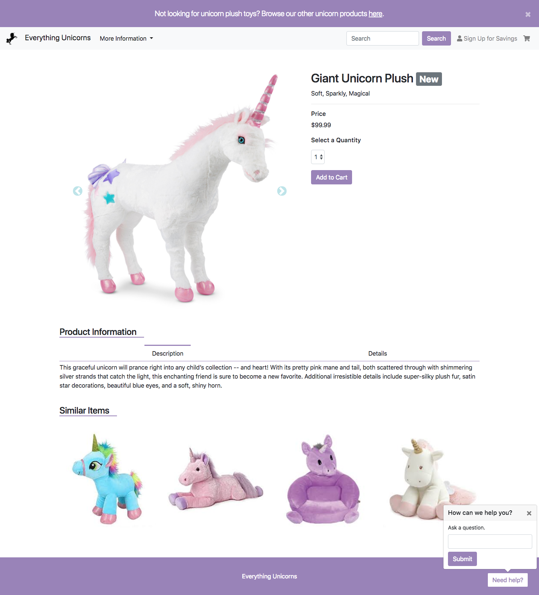
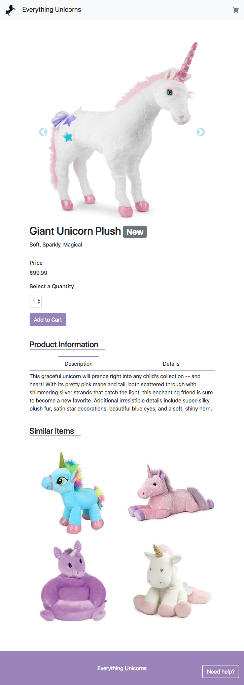
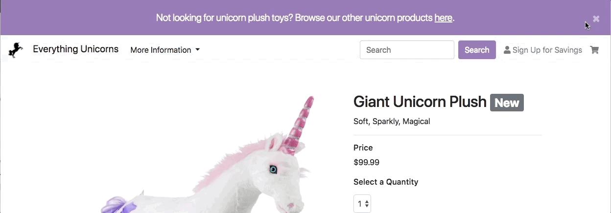
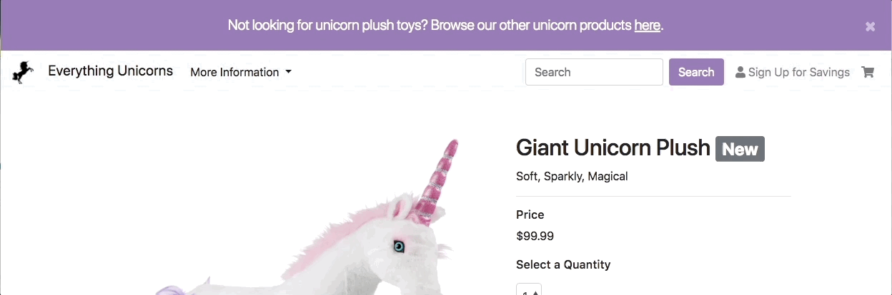
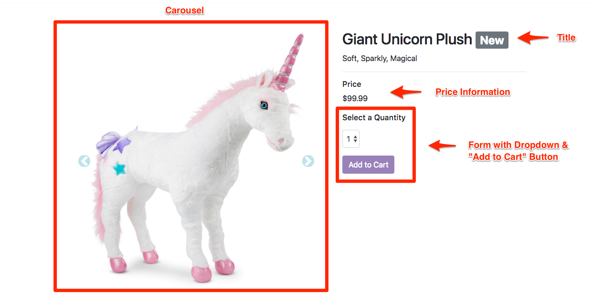
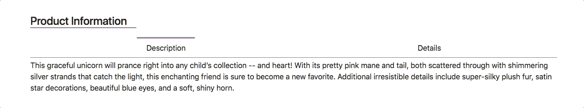
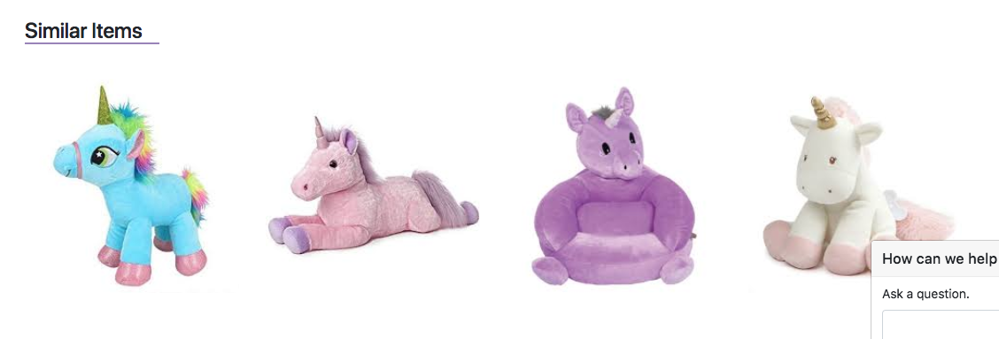
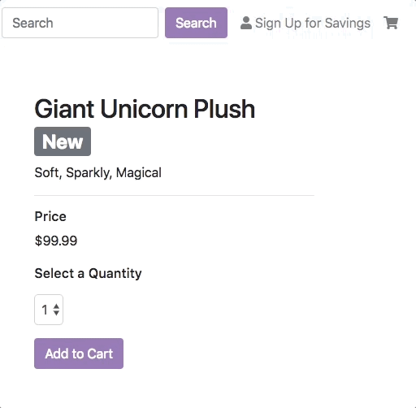

# Unit 19 | Assignment - Interactive E-Commerce

### Background

Now that you've learned how to use jQuery to customize Bootstrap's interactive components, it's time to combine all of your newfound coding skills to build a e-commerce prototype.

  

In this homework assignment, you will be accomplishing four main tasks:

  1. Creating a folder structure for a webpage.

  1. Incorporating Bootstrap and custom CSS and JavaScript.

  1. Creating a e-commerce prototype website with multiple interactive elements.

  1. Publishing your page using GitHub Pages.

### Instructions

  1. Create a folder structure for your webpage.

     - Your folder should include:

     - An HTML file

     - A CSS file

     - A JavaScript File

     - A folder for images

  1. Incorporate Bootstrap and custom CSS and JavaScript.

     - Incorporate Bootstrap's CSS and JavaScript CDNs.

     - Include a link to your custom CSS file.

     - Use a script tag to incorporate your Javascript file.

  1. Create a responsive e-commerce prototype website with multiple interactive elements.

     - The website should have two responsive layouts, mobile and desktop.

     - **Mobile Layout**:

       

     - You can customize the design, but be sure to include the following:

       1. An alert at the top of the page that is dismissible.

          

       1. A navbar below the alert that "sticks" to the top of the page as you scroll.

          

        1. A modal that is triggered by a link in the navbar. The modal should have the following:

            - A sign up form with submit button.

            - Alerts that are shown if the email or first name fields are left blank.

            - Content should change to a confirmation message upon successful submission of the form.

              

        1. A Bootstrap carousel displaying images of the product.

        1. A section that includes the product title, price, form to select a quantity, and "Add to Cart" button.

           

        1. A tab section that displays product information dynamically.

           

        1. A button that toggles a custom popover whose positioning is fixed to the page. The button should change background color based on whether the popover is opened or closed.

           

        1. A "Similar Items" section.

           

  1. Publishing your page using GitHub Pages.

     - Push your files up to GitHub.

     - Publish the page using GitHub pages.

     - Visit the link to visit your published page.

### Hints and Considerations

- In general, you should be using the [Bootstrap Documentation](https://getbootstrap.com/docs/4.1/components/alerts/) for each component.

- See the [Bootstrap Documentation on Navs - Javascript Behavior](https://getbootstrap.com/docs/4.1/components/navs/#javascript-behavior) for help with the Product Information section.

- Look for a [Bootstrap Utility Class](https://getbootstrap.com/docs/4.1/utilities/position/) or checkout out the [NavBar Docs](https://getbootstrap.com/docs/4.1/components/navbar/#placement).

- Use the solution to the in-class custom popover activity for a template to create a customized popover.

- Explore `.toggle()`, `.toggleClass()`, `.show()`,`.hide()`, and `html()` jQuery methods and consider using them in your code.

- For aesthetics, add smooth transitions.

### Bonus

- Add a counter to your cart icon that keeps track of the number of items added to the cart.

  

### Submission

- Submit the link to your GitHub repo and the link to your published page to BootCamp Spot.
